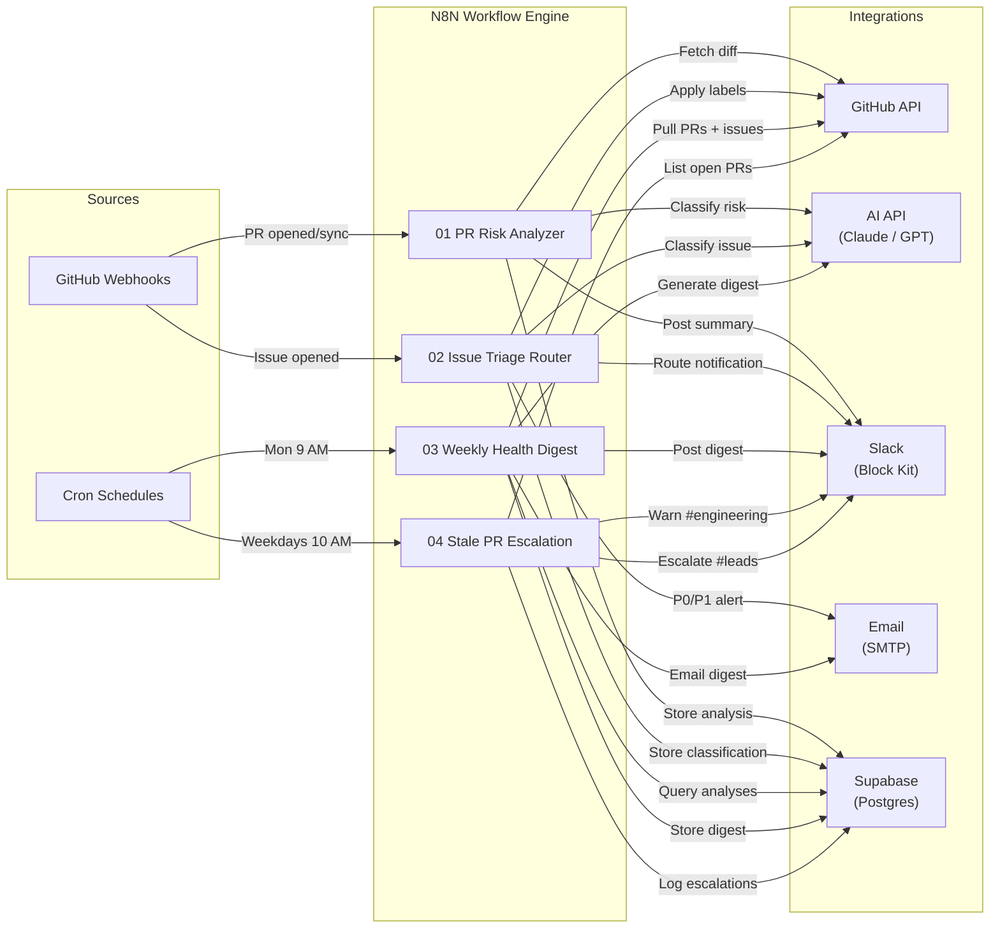

# 🚢 ShipWatch — AI-Powered Deployment Monitor & Incident Response Pipeline

ShipWatch is an event-driven GitHub ops platform that uses N8N workflows and AI classification to automate the tedious parts of repository maintenance: every pull request is risk-scored by Claude (or GPT), every new issue is triaged and routed to the right Slack channel, a weekly executive digest lands in your inbox every Monday, and stale PRs get escalated before they rot. It runs entirely self-hosted via Docker, stores its audit trail in Supabase (Postgres), and communicates through Slack Block Kit — no SaaS bills, no black boxes.

---

## 🏗 Architecture



GitHub webhooks fire into N8N for real-time events (PR opens, issue creation), while cron triggers handle scheduled work (digest generation, staleness checks). Every workflow follows the same shape: ingest data, optionally classify with AI, format and deliver notifications, then persist results to Supabase for historical tracking. Error handlers on each workflow ensure that failures surface in Slack rather than disappearing silently.

---

## ✨ Features

### PR Risk Analyzer

<!-- Screenshot: PR Risk Analyzer workflow in N8N editor -->

When a pull request is opened or updated, ShipWatch fetches the diff via the GitHub API, truncates it to a 12k-character window, and sends it to Claude with a structured prompt requesting risk classification. The AI returns a JSON risk level (low/medium/high/critical), key concerns, and suggested reviewers. A Slack Block Kit message lands in #engineering with color-coded severity, a direct link to the PR, and an action button — the full classification is stored in Supabase's `pr_analyses` table.

**Patterns:** GitHub webhook ingestion, AI-structured JSON output, Slack Block Kit formatting with emoji severity mapping, graceful parse-failure fallbacks.

### Issue Triage Router

<!-- Screenshot: Issue Triage Router workflow in N8N editor -->

New GitHub issues are classified by type (bug, feature, question, documentation, security) and priority (P0–P3) using an AI prompt that includes the issue title, body, and labels. The workflow applies the appropriate labels back to GitHub via the API, then routes a formatted Slack notification to the correct channel: bugs and security issues go to #incidents, feature requests to #product, questions to #support, and documentation tasks to #engineering. P0 and P1 issues also trigger an email escalation.

**Patterns:** AI multi-label classification, GitHub label management via API, Switch-node channel routing, conditional email escalation for high-priority items.

### Weekly Health Digest

<!-- Screenshot: Weekly Health Digest workflow in N8N editor -->

Every Monday at 9 AM, three parallel HTTP requests pull the week's PRs, issues, and stored analyses from GitHub and Supabase. A Code node aggregates the raw data into stats (merge velocity, risk breakdown, classification counts) and builds an AI prompt requesting an executive summary. Claude returns highlights, concerns, and a recommended focus area — the digest is delivered as a Slack Block Kit post, an HTML email, and a Markdown record in Supabase.

**Patterns:** Parallel data fetching with Merge nodes, date-range computation for API queries, AI-generated executive summaries, multi-format output (Slack + HTML email + Markdown storage).

### Stale PR Escalation

<!-- Screenshot: Stale PR Escalation workflow in N8N editor -->

On weekday mornings at 10 AM, ShipWatch queries all open PRs sorted by least-recently-updated and runs them through a filter that categorizes staleness: PRs untouched for 48–119 hours get a warning, and those past 120 hours (5 days) are flagged critical. Warnings are posted to #engineering as a roundup; critical PRs are escalated to #leads with an `@channel` mention. Each critical escalation is logged to the Supabase `escalations` table with the PR URL, author, and days stale.

**Patterns:** Cron-driven staleness detection, tiered severity thresholds, per-item Supabase logging via loop, `@channel` escalation for critical items.

---

## 🚀 Quick Start

```bash
# Clone
git clone https://github.com/SephrixEvonaut/shipwatch.git
cd shipwatch

# Configure
cp .env.example .env
# Edit .env with your API keys (see Setup Guide)

# Launch
docker compose up -d

# Import workflows
# Open http://localhost:5678, go to Workflows → Import, and import each JSON from workflows/
```

After importing, activate each workflow in the N8N editor. Point your GitHub repo's webhooks at your N8N instance's webhook URLs (displayed in each Webhook Trigger node) and you're live.

---

## 🔧 Setup Guide

See [docs/setup-guide.md](docs/setup-guide.md) for detailed step-by-step instructions.

You'll need:

- **Docker & Docker Compose** installed locally
- A **GitHub Personal Access Token** with `repo` scope
- An **Anthropic API key** (or OpenAI key if you prefer GPT)
- **Slack incoming webhooks** for each target channel (#engineering, #incidents, #product, #support, #leads)
- A **Supabase project** (free tier works) with the schema from `scripts/supabase-schema.sql` applied
- **SMTP credentials** (optional, for email delivery)

---

## 📊 Tech Stack

| Layer                | Technology                                                         |
| -------------------- | ------------------------------------------------------------------ |
| Workflow Engine      | [N8N](https://n8n.io) (self-hosted, Docker)                        |
| Container Runtime    | Docker Compose                                                     |
| Internal Database    | PostgreSQL 16 (N8N persistence)                                    |
| Application Database | [Supabase](https://supabase.com) (Postgres + REST API + RLS)       |
| AI Classification    | Anthropic Claude (`claude-sonnet-4-20250514`) / OpenAI GPT-4o-mini |
| Source Control API   | GitHub REST API v3                                                 |
| Notifications        | Slack Block Kit (incoming webhooks)                                |
| Email                | SMTP (any provider)                                                |
| Language             | JavaScript (N8N Code nodes)                                        |

---

## 🧪 Testing

The simplest way to test is against a live (or test) repository:

1. **PR Risk Analyzer** — Open or update a PR on the connected repo. A Slack message should appear in #engineering within seconds.
2. **Issue Triage Router** — Create a new issue. Watch for the label application on GitHub and the routed Slack notification.
3. **Weekly Digest** — In the N8N editor, open the Weekly Health Digest workflow and click "Execute Workflow" to trigger it manually.
4. **Stale PR Escalation** — Same approach: manually execute the workflow, or leave a PR untouched for 48+ hours and wait for the next scheduled run.

For seeding test data into Supabase, see [`scripts/seed-test-data.sh`](scripts/seed-test-data.sh).

---

## 📝 Design Decisions

**N8N over raw code.** A purpose-built API server could handle these workflows, but N8N provides a visual canvas that makes debugging and iteration fast — you can inspect the output of every node in a failed execution without adding logging. The low-code surface also means non-engineers can understand what the system does by looking at the workflow graph, which matters when on-call rotations change.

**AI classification with structured JSON.** Both Claude and GPT reliably produce structured JSON when given a clear schema in the system prompt. By requesting a fixed shape (`{ risk_level, concerns, suggested_reviewers }`) rather than free-form text, the downstream formatting code stays simple — it's just property access, not NLP parsing. The prompts include explicit classification criteria so the model isn't guessing at what "high risk" means for your team.

**Graceful degradation over hard failure.** Every workflow wraps AI response parsing in try/catch with a fallback message. If the AI service is down or returns garbage, the team still gets a Slack notification with the raw PR/issue metadata — they just lose the AI-generated summary. The error handler chain ensures that infrastructure failures (API timeouts, Supabase outages) surface in Slack rather than failing silently. Supabase writes are intentionally fire-and-forget so a database hiccup never blocks a time-sensitive notification.

**Supabase for persistence.** The audit trail needs a real database, but standing up and maintaining a dedicated Postgres instance is overkill for this use case. Supabase's free tier provides a managed Postgres instance with a REST API that N8N's HTTP Request nodes can call directly — no ORM, no SDK, no server code. Row-level security policies are applied at the schema level, so even if the anon key leaks, data access is scoped correctly.

---

## 📄 License

MIT
