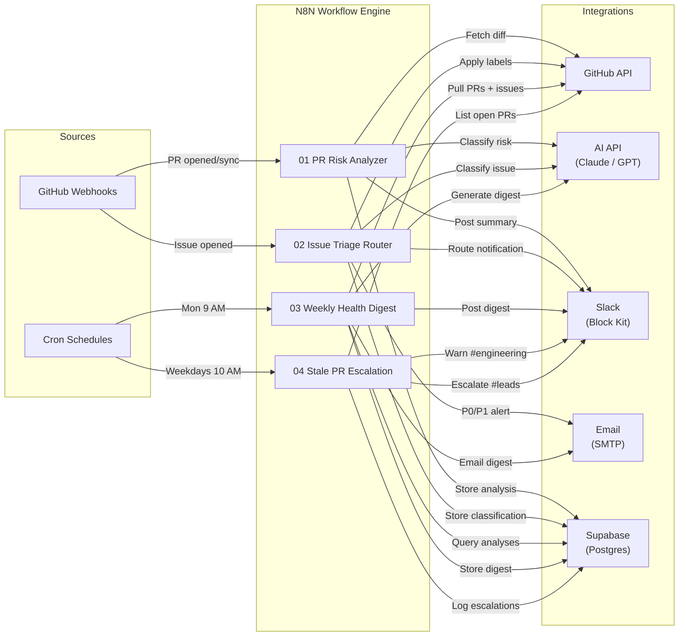

# ShipWatch — Architecture

## 1. System Overview

ShipWatch is an automated GitHub repository health platform built on N8N that monitors pull requests, triages issues, generates weekly engineering digests, and escalates stale work — replacing manual repo hygiene with AI-powered workflows that classify risk, route notifications to the right Slack channels, and maintain a persistent audit trail in Supabase.

### Workflows

| #   | Workflow                 | Description                                                                                                     |
| --- | ------------------------ | --------------------------------------------------------------------------------------------------------------- |
| 1   | **PR Risk Analyzer**     | Classifies every opened/updated PR by risk level (low → critical) and posts a formatted summary to Slack.       |
| 2   | **Issue Triage Router**  | Classifies new issues by type and priority, applies GitHub labels, and routes to the appropriate Slack channel. |
| 3   | **Weekly Health Digest** | Aggregates the previous week's PR, issue, and analysis data and delivers an AI-generated executive summary.     |
| 4   | **Stale PR Escalation**  | Scans open PRs on weekday mornings, warns on 2-day staleness, and escalates 5-day stale PRs to team leads.      |

---

## 2. Architecture Diagram



---

## 3. Data Flows

### 3.1 PR Risk Analyzer

```
GitHub PR event (opened / synchronize)
  │
  ├─ IF action not relevant → Respond 200, stop
  │
  └─ Code: Fetch Diff
       → GET /repos/{owner}/{repo}/pulls/{number}/files
       → Truncate combined diff to 12 000 chars
       │
       └─ Code: Build AI Prompt
            → System: "You are a senior engineer…"
            → User: PR metadata + diff text
            │
            └─ HTTP: Anthropic /v1/messages
                 → Classify risk: low | medium | high | critical
                 │
                 └─ Code: Format Slack Message
                      → Slack Block Kit with emoji, fields, action button
                      │
                      ├─ POST → Slack #engineering webhook
                      ├─ POST → Supabase pr_analyses table
                      └─ Respond 200 to webhook
```

### 3.2 Issue Triage Router

```
GitHub Issue event (opened)
  │
  ├─ IF action ≠ opened → Respond 200, stop
  │
  └─ Code: Build Classification Prompt
       → Type: bug | feature | question | documentation | security
       → Priority: P0 | P1 | P2 | P3
       → Routing recommendation
       │
       └─ HTTP: Anthropic /v1/messages
            │
            └─ Code: Parse & Route
                 → Build Slack Block Kit per channel
                 │
                 ├─ HTTP: Apply GitHub label (type + priority)
                 │
                 └─ Switch on classification:
                      ├─ bug / security → #incidents
                      ├─ feature        → #product
                      ├─ question       → #support
                      └─ documentation  → #engineering
                           │
                           ├─ IF P0 or P1 → Email escalation
                           ├─ POST → Supabase issue_classifications
                           └─ Respond 200
```

### 3.3 Weekly Health Digest

```
Cron: Monday 9:00 AM
  │
  ├── HTTP: GET /repos/{repo}/pulls  (state=all, last 100)
  ├── HTTP: GET /repos/{repo}/issues (since=last Monday)
  └── HTTP: GET Supabase pr_analyses (analyzed_at ≥ last Monday)
       │
       └─ Merge (3 sources)
            │
            └─ Code: Aggregate Stats
                 → PR counts, merge times, risk breakdown
                 → Issue counts, classification breakdown
                 → Build AI prompt
                 │
                 └─ HTTP: Anthropic /v1/messages
                      → executive_summary, highlights, concerns, focus_area
                      │
                      └─ Code: Format Outputs
                           │
                           ├─ POST → Slack #engineering (Block Kit)
                           ├─ Email → DIGEST_EMAIL_LIST (HTML)
                           └─ POST → Supabase weekly_digests
```

### 3.4 Stale PR Escalation

```
Cron: Weekdays 10:00 AM
  │
  └─ HTTP: GET /repos/{repo}/pulls
       → state=open, sort=updated, direction=asc, per_page=100
       │
       └─ Code: Filter Stale PRs
            → Warning: 48–119 hours since last update
            → Critical: 120+ hours since last update
            → Sort by staleness descending
            │
            └─ IF total_stale > 0:
                 │
                 ├─ IF warnings > 0:
                 │    └─ POST → Slack #engineering
                 │         "⏰ Stale PR Roundup — {date}"
                 │
                 └─ IF critical > 0:
                      ├─ POST → Slack #leads
                      │    "🚨 Critical: PRs stale 5+ days"
                      │    @channel mention
                      │
                      └─ For each critical PR:
                           └─ POST → Supabase escalations
                                escalation_type: stale_pr
                                days_stale, escalated_to: #leads
```

---

## 4. Technology Decisions

### N8N — Workflow Engine

- **Open-source and self-hostable** — runs in Docker alongside Postgres, no vendor lock-in or per-execution pricing.
- **Visual + code hybrid** — the canvas gives non-developers visibility into flows while Code nodes provide full JavaScript for complex logic (diff truncation, structured prompt building, Slack Block Kit assembly).
- **Native webhook support** — first-class Webhook Trigger nodes accept GitHub payloads without any external gateway.

### Supabase — Persistence Layer

- **Generous free tier** — Postgres-backed database with a REST API out of the box, no additional server code required.
- **Row-level security (RLS)** — policies restrict data access per authenticated role directly at the database level.
- **REST API for N8N** — N8N's HTTP Request node can read/write Supabase tables using simple `apikey` + `Authorization` headers, no SDK needed.

### Slack Block Kit — Notifications

- **Rich, structured formatting** — headers, dividers, fields, and context blocks produce readable at-a-glance summaries.
- **Actionable buttons** — "View PR" actions link directly to GitHub without switching context.
- **Multiple webhook channels** — each classification routes to its own channel (#engineering, #incidents, #product, #support, #leads).

### Claude / GPT — AI Classification

- **Structured JSON output** — both models reliably produce the JSON schema requested in system prompts (risk_level, classification, priority, executive_summary, etc.).
- **Token-efficient** — PR diffs are truncated to 12 000 chars and issue bodies to their first ~4 000 chars, keeping costs predictable.
- **Provider-swappable** — workflows include notes on switching between Anthropic and OpenAI with a header/body change; no code-node edits required.

---

## 5. Error Handling Strategy

### Per-Workflow Error Trigger

Every workflow includes an **Error Trigger** node connected to a Code → Slack alert chain. If any node in the main flow throws, the error handler posts a `⚠️ ShipWatch: {workflow} failed` message to #engineering with the execution ID and error message.

### AI API Failures

- AI response parsing wraps `JSON.parse` in try/catch and strips markdown fences (` ```json … ``` `).
- On parse failure, formatters emit a **degraded fallback message** — the notification still reaches Slack with raw metadata, just without the AI classification.
- This ensures teams are never silently unaware of a PR or issue even if the AI service is down.

### GitHub API Rate Limiting

- Requests include `Accept: application/vnd.github.v3+json` and Bearer token authentication, which provides 5 000 requests/hour.
- Stale PR and digest workflows run on scheduled intervals (once daily / once weekly), keeping API usage well within limits.
- N8N's built-in retry-on-failure settings can be enabled per HTTP Request node for transient 5xx errors.

### Supabase Writes — Fire and Forget

- Database inserts (pr_analyses, issue_classifications, weekly_digests, escalations) run in **parallel with or after** Slack notifications.
- A Supabase write failure does not block the notification path — the team still gets the alert; the audit record can be backfilled.

---

## 6. Security Considerations

### Secrets Management

- All API keys, tokens, and webhook URLs are stored in **environment variables** (`.env` file, never committed).
- Workflow JSON files reference secrets exclusively via `{{ $env.VAR_NAME }}` expressions — no plaintext secrets in any exported workflow.

### GitHub Webhook Validation

- **Optional enhancement:** N8N supports a header-auth credential type that can validate the `X-Hub-Signature-256` header against a shared webhook secret, ensuring payloads originate from GitHub.
- Webhook endpoints should be protected via HTTPS (reverse proxy or N8N's built-in TLS) when exposed to the internet.

### Supabase Row-Level Security

- All four tables have RLS enabled (`ALTER TABLE … ENABLE ROW LEVEL SECURITY`).
- Policies restrict read/write to the `authenticated` role, preventing anonymous access to analysis data.
- The `anon` key used by N8N has the minimum privileges needed.

### AI Prompt Hygiene

- Prompts contain only PR diff content and issue body text — **no secrets, tokens, or PII** are injected into AI requests.
- Diffs are truncated to 12 000 characters, limiting exposure of large codebases.
- AI responses are treated as untrusted: all JSON from the AI is parsed defensively with fallback defaults.

---

## Database Schema

Four tables in Supabase, all with RLS and relevant indexes:

| Table                   | Key Columns                                                     | Purpose                                   |
| ----------------------- | --------------------------------------------------------------- | ----------------------------------------- |
| `pr_analyses`           | pr_number, risk_level, concerns, suggested_reviewers            | Stores AI risk classification per PR      |
| `issue_classifications` | issue_number, classification, priority, routed_to               | Stores AI issue triage decisions          |
| `weekly_digests`        | week_start, week_end, digest_markdown, high_risk_prs            | Stores rendered weekly digest content     |
| `escalations`           | escalation_type, github_url, days_stale, escalated_to, resolved | Tracks stale PR and P0 escalation history |

---

## Environment Variables

| Variable                                           | Used By          | Purpose                              |
| -------------------------------------------------- | ---------------- | ------------------------------------ |
| `GITHUB_TOKEN`                                     | All workflows    | GitHub API authentication (Bearer)   |
| `GITHUB_REPO`                                      | All workflows    | Target repo in `owner/repo` format   |
| `ANTHROPIC_API_KEY`                                | WF 1, 2, 3       | Claude API authentication            |
| `OPENAI_API_KEY`                                   | WF 1, 2, 3 (alt) | GPT API authentication (swap-in)     |
| `SLACK_WEBHOOK_URL`                                | WF 1             | Default Slack channel                |
| `SLACK_WEBHOOK_ENGINEERING`                        | WF 1, 3, 4       | #engineering channel                 |
| `SLACK_WEBHOOK_INCIDENTS`                          | WF 2             | #incidents channel                   |
| `SLACK_WEBHOOK_PRODUCT`                            | WF 2             | #product channel                     |
| `SLACK_WEBHOOK_SUPPORT`                            | WF 2             | #support channel                     |
| `SLACK_WEBHOOK_LEADS`                              | WF 4             | #leads channel (critical escalation) |
| `SUPABASE_URL`                                     | WF 1, 2, 3, 4    | Supabase project REST endpoint       |
| `SUPABASE_ANON_KEY`                                | WF 1, 2, 3, 4    | Supabase anonymous/service key       |
| `SMTP_HOST`, `SMTP_PORT`, `SMTP_USER`, `SMTP_PASS` | WF 2, 3          | SMTP email credentials               |
| `ESCALATION_EMAIL`                                 | WF 2             | P0/P1 escalation recipient           |
| `DIGEST_EMAIL_LIST`                                | WF 3             | Weekly digest recipient list         |
